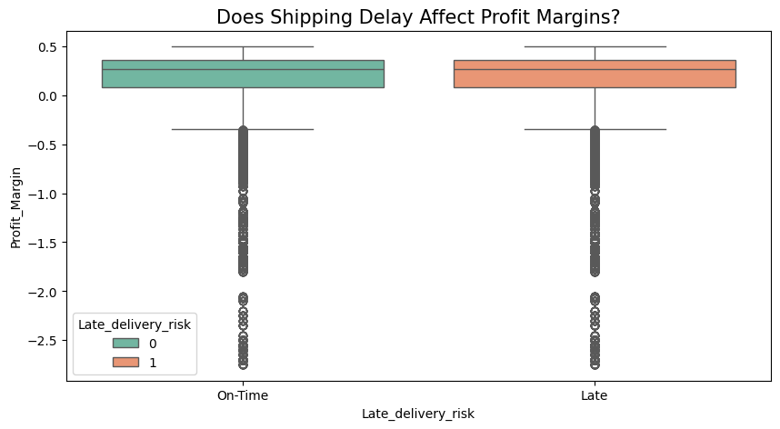
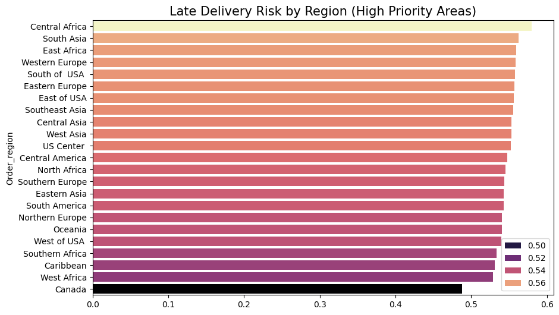
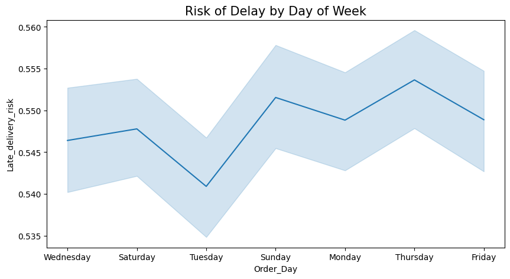
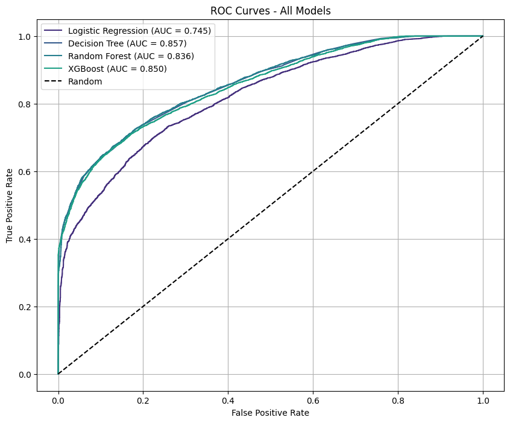
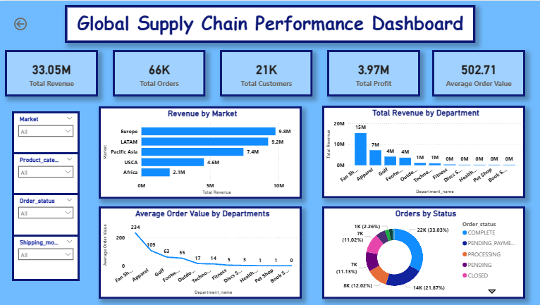
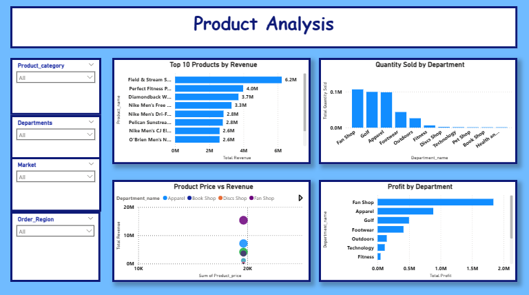
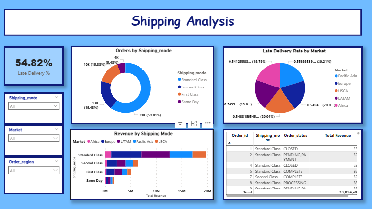

<div align="center">
  <h1>🚛 Global Supply Chain Late Delivery Risk Prediction</h1>
  
  <p><strong>End-to-End Machine Learning Solution</strong></p>
  
  <h2>
    <span style="color: #22c55e;">★ Best Model:</span> 
    <span style="color: #eab308;">Decision Tree (AUC = 0.857)</span>
  </h2>

  <p>
    Predicting whether an order will arrive 
    <strong style="color: #ef4444;">late</strong> or 
    <strong style="color: #22c55e;">on time</strong><br>
    using the DataCo Supply Chain Dataset
  </p>
</div>

---

## 📊 Project Overview

This project aims to **predict late delivery risk** in the supply chain using historical order and shipping data.  

After extensive EDA, feature engineering, and model evaluation, the **Decision Tree** emerged as the best performing model with an impressive **ROC-AUC of 0.857**, outperforming XGBoost, Random Forest, and Logistic Regression.

### Key Achievements
- Handled class imbalance (~54.8% late deliveries)
- Built an interactive **Streamlit web app** with live predictions
- Created a comprehensive **Power BI dashboard** for business insights
- Focused on model interpretability and low overfitting

---
## 📈 Exploratory Data Analysis

### Key Visual Insights

#### 1. Does Shipping Mode Affect Late Delivery?



#### 2. Late Risk by Region 



#### 3. Risk of Delay by Week



#### 4. Model Comparison - ROC Curves



---

## 🤖 Modelling Results

**Winner Model: Decision Tree** with **ROC-AUC = 0.857**

### Model Comparison

| Model                | ROC-AUC   | Status      |
|----------------------|-----------|-------------|
| Decision Tree        | **0.857** | 🏆 **Winner** |
| XGBoost              | 0.850     | Strong      |
| Random Forest        | 0.836     | Good        |
| Logistic Regression  | 0.745     | Baseline    |

The Decision Tree was selected for its excellent performance, simplicity, and low overfitting.

---

## 📈 Power BI Interactive Dashboard

**Professional Business Intelligence Dashboard** built in Power BI for deep visual analysis of late delivery risks, shipping performance, and store delays.

<br>

#### Dashboard Overview



<br>

#### Product Analysis 


<br>

#### Shipping Analysis 


</div>

### Download Full Interactive Dashboard

[](dashboards/supplychain.pbix)

**How to view:**  
Download the `.pbix` file and open it with **free Power BI Desktop** for full interactivity, slicers, and drill-downs.

---

## 🌐 Live Demo

Try the **Live Prediction App** built with Streamlit:

[](https://your-app-name.streamlit.app)

**Features:**
- Real-time late delivery predictions using the Decision Tree model
- Interactive input form
- Instant probability scores

---

## 🛠️ Tech Stack

| Category                  | Technologies & Tools |
|---------------------------|----------------------|
| **Programming Language**  | 🐍 **Python 3.14** |
| **Data Processing**       | 🐼 **Pandas** • 🔢 **NumPy** |
| **Machine Learning**      | 🤖 **Scikit-learn** • 🌲 **Decision Tree** • 🚀 **XGBoost** • 🌳 **Random Forest** |
| **Data Visualization**    | 📊 **Plotly** • 📉 **Matplotlib** • 📈 **Power BI** • 🌊 **Seaborn** |
| **Web Application**       | 🌐 **Streamlit** |
| **Model Serialization**   | 📦 **Joblib** |
| **Version Control**       | 🐙 **Git** • **GitHub** |
| **Development Tools**     | 📒 **Jupyter Notebook** • 👨‍💻 **VS Code** |

---

## 📁 Project Structure

supply-chain-late-delivery-prediction/

├── data/                  # Raw and processed datasets

├── models/                # Trained models (.pkl)

├── plots/                 # EDA and model plots

├── dashboards/            # Power BI .pbix file

├── deployment/            # Streamlit app.py

├── notebooks/             # Jupyter notebooks

├── src/                   # Reusable Python scripts

├── README.md

├── requirements.txt

└── app.py


## 🚀 How to Run Locally

1. Clone the repository:
```bash
git clone https://github.com/yourusername/supply-chain-late-delivery-prediction.git
```

2. Install dependencies: 
 ```bash
pip install -r requirements.txt
```
3. Run the Streamlit app:
 ```bash
streamlit run app.py
```

---

<div align="center">

⭐ **If you found this useful, consider giving it a star!** ⭐

---

*Made with 💖 by **Jovin Ryan Samuel***

[](https://github.com/jovinryan20/)

</div>
